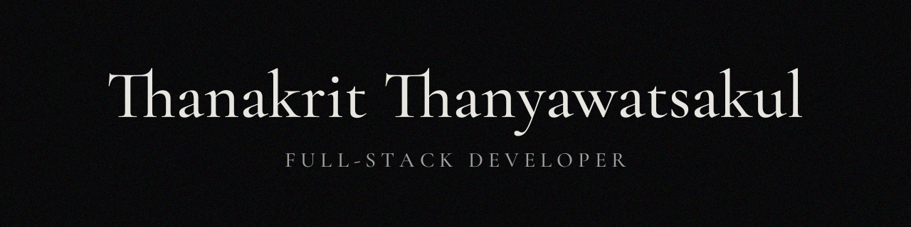

# Thanakrit Thanyawatsakul
**Full-Stack Developer · Performance Focus**
*Chiang Mai, Thailand*

### [Portfolio](https://thanakrit.dev) · [LinkedIn](https://www.linkedin.com/in/thanakrit-thanyawatsakul/) · [Email](mailto:thanakrit.than.biz@gmail.com)

## 🛠️ Performance & Craftsmanship
*   **Optimization**: Delivered production applications achieving **100/100 Lighthouse** scores and **LCP < 1s** through deep-level performance tuning.
*   **Velocity**: Successfully shipped **4 major web products in 6 months** while maintaining high quality standards.
*   **Quality**: Ensuring stability with **100% test coverage** using Playwright and Vitest for mission-critical features.
*   **Experience**: 2 years of professional hospitality-driven communication and systematic problem solving.

## 💻 Tech Stack

**Frontend**

**Backend**

**Infrastructure**

---

