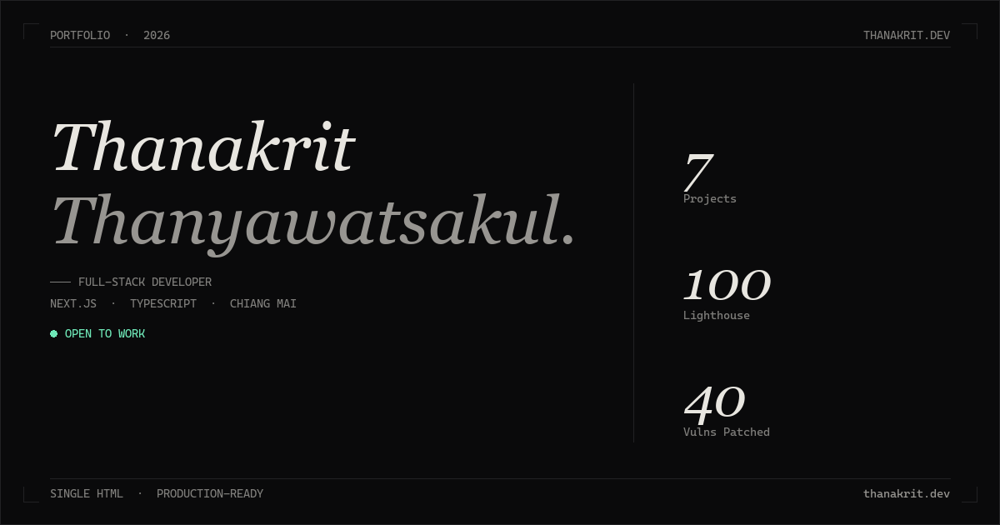

# Thanakrit Thanyawatsakul
**Full-Stack Developer specializing in high-performance web applications** *Based in Chiang Mai, Thailand*

[Portfolio](https://thanakrit.dev) • [LinkedIn](https://www.linkedin.com/in/thanakrit-thanyawatsakul/) • [Email](mailto:thanakrit.than.biz@gmail.com)

---

### "A product is only finished when it is fast enough to feel invisible to the user."

### 🏗️ Engineering & Craft
I build digital products with a focus on **performance**, **maintainability**, and **accessibility**. My work bridges the gap between complex backend logic and fluid, high-performance frontend interfaces.

* **High-Velocity Delivery**: Shipped **4 major web products within 6 months**, working in 10-person Agile teams.
* **Performance Excellence**: Achieving **Lighthouse 100/100** and **LCP ≈ 0.4s** on production-ready applications.
* **Complex Systems**: Experienced in architecting management systems (PMS) and scalable B2B platforms.

### 🛠️ Technical Focus
* **Frontend**: Next.js (App Router), React, TypeScript, Tailwind CSS
* **Backend**: Node.js, PostgreSQL, RESTful APIs
* **Quality**: 100% test coverage using Playwright (E2E) and Vitest
* **Workflow**: Docker, CI/CD via GitHub Actions, Linux

---

